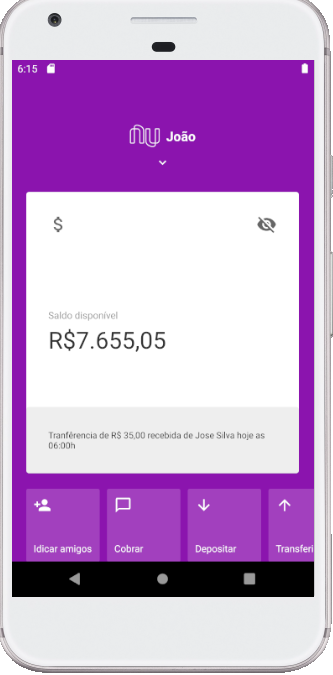
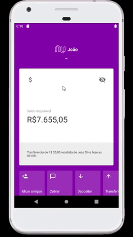

  <a href="#rocket-tecnologias">Tecnologias</a>&nbsp;&nbsp;&nbsp;|&nbsp;&nbsp;&nbsp;
  <a href="#-projeto">Projeto</a>&nbsp;&nbsp;&nbsp;|&nbsp;&nbsp;&nbsp;
  <a href="#-como-rodar">Como rodar</a>&nbsp;&nbsp;&nbsp;|&nbsp;&nbsp;&nbsp;
  <a href="#-como-contribuir">Como contribuir</a>&nbsp;&nbsp;&nbsp;
  

 

## Clonando interface do Nubank (+ ANIMAÇÕES) com React Native

## 🚀 Tecnologias

Esse projeto foi desenvolvido com as seguintes tecnologias:

- [React Native](https://reactnative.dev/) - 0.63.3
- [Yarn](https://yarnpkg.com/) - 1.22.4
- [Npm](https://www.npmjs.com/) - 6.14.5

## 💻 Projeto

O projeto é um clone do layout do Nubank usando React Native.
Video da Rocketseat desenvolvendo o projeto [Link](https://www.youtube.com/watch?v=DDm0M_rZLJo&t=1025s)

  

  

  

## 🚀 Como Rodar

- Clone o projeto.
- Entre na pasta do projeto e rode yarn install (pode usar npm install de acordo com a sua configuração).
- yarn android para rodar o emulador.

Para rodar o emulador do Android ou iOS siga o guia da [Rocketseat](https://react-native.rocketseat.dev/).

## 🤔 Como contribuir

- Faça um fork desse repositório;
- Cria uma branch com a sua feature: `git checkout -b minha-feature`;
- Faça commit das suas alterações: `git commit -m 'feat: Minha nova feature'`;
- Faça push para a sua branch: `git push origin minha-feature`.

Depois que o merge da sua pull request for feito, você pode deletar a sua branch.

## 📝 Licença

Esse projeto está sob a licença MIT.
